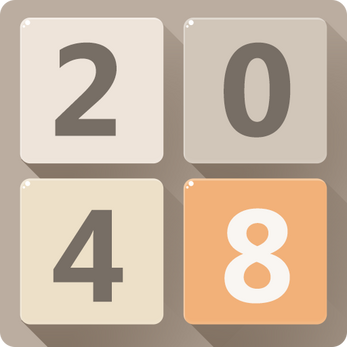

# 🚀 ¡Hola! Soy **bitforge**

  

  

  

## 🎯 **Sobre mí**

<table>
<tr>
<td>

**🌟 Desarrollador Apasionado**
- 💡 Creando soluciones innovadoras con código
- 🚀 Explorando nuevas tecnologías constantemente
- 🎯 Enfocado en la resolución de problemas
- 🤝 Colaborando con la comunidad de desarrolladores
- ⚡ **Transformando ideas en realidad digital**

</td>
<td>

</td>
</tr>
</table>

---

## 🌟 **Mi Filosofía de Desarrollo**

  
  
  <h3>🔥 Principios que me Guían</h3>
  
  <table>
    <tr>
      <td align="center" width="50%">
        
         
        <em>Escribir código que otros puedan entender y mantener</em>
      </td>
      <td align="center" width="50%">
        
         
        <em>Aprender algo nuevo cada día y aplicarlo</em>
      </td>
    </tr>
    <tr>
      <td align="center" width="50%">
        
         
        <em>Buscar soluciones creativas a problemas complejos</em>
      </td>
      <td align="center" width="50%">
        
         
        <em>Compartir conocimiento y aprender de otros</em>
      </td>
    </tr>
  </table>

---

## 🏆 **Plataformas de Práctica**

  
  
  <h3>🎮 Donde Desarrollo mis Habilidades</h3>
  
  <table>
    <tr>
      <td align="center" width="25%">
        
         
        
      </td>
      <td align="center" width="25%">
        
         
        
      </td>
      <td align="center" width="25%">
        
         
        
      </td>
      <td align="center" width="25%">
        
         
        
      </td>
    </tr>
  </table>

---

## 📈 **Actividad en GitHub**

  
  
  <h3>🔥 Contribuciones Recientes</h3>
  
  <table>
    <tr>
      <td align="center">
        
      </td>
    </tr>
  </table>

---

## 🛠️ **Stack Tecnológico**

  
  
  <h3>⚡ Herramientas y Tecnologías</h3>

  <table>
    <tr>
      <td align="center" width="33%">
        <h4>🔧 Lenguajes</h4>
        
         
        
        
        
      </td>
      <td align="center" width="33%">
        <h4>🚀 Herramientas</h4>
        
         
        
        
        
      </td>
      <td align="center" width="33%">
        <h4>🌐 Tecnologías</h4>
        
         
        
        
        
      </td>
    </tr>
  </table>

---

## 📊 **Estadísticas de GitHub**

  
  

  

---

## 🎯 **Áreas de Interés**

  

  <table>
    <tr>
      <td align="center" width="25%">
        
         
        
         <em>Estructuras de datos y optimización</em>
      </td>
      <td align="center" width="25%">
        
         
        
         <em>Creación de experiencias interactivas</em>
      </td>
      <td align="center" width="25%">
        
         
        
         <em>Aplicaciones modernas y responsive</em>
      </td>
      <td align="center" width="25%">
        
         
        
         <em>Contribuciones a la comunidad</em>
      </td>
    </tr>
  </table>

---

## 📚 **Recursos Favoritos**

  <table>
    <tr>
      <td align="center" width="25%">
        
         
        
         <em>Siempre la primera fuente</em>
      </td>
      <td align="center" width="25%">
        
         
        
         <em>Aprendizaje visual</em>
      </td>
      <td align="center" width="25%">
        
         
        
         <em>Resolver dudas juntos</em>
      </td>
      <td align="center" width="25%">
        
         
        
         <em>Aprender haciendo</em>
      </td>
    </tr>
  </table>

---

## 💡 **Inspiración Diaria**

  

  

---

## 🔥 **Contribuciones**

  

---

## 📊 **Métricas de Productividad**

  

  
  

  
  

---

## 🏆 **Logros y Trofeos**

  

---

## 🌟 **Proyectos Destacados**

 <table>
   <tr>
     <td width="50%">
       

         
            
         
       

     </td>
     <td width="50%">
       

         
            
         
       

     </td>
   </tr>
 </table>

---

## 🌐 **Conecta Conmigo**

  
  
  <table>
    <tr>
      <td align="center">
        
      </td>
      <td align="center">
        
      </td>
      <td align="center">
        
      </td>
    </tr>
  </table>
  
  

---

  
  
  

  <h3>🌟 "El código es la herramienta, la creatividad es el poder" 🌟</h3>
  
<em>Cada proyecto es una oportunidad de crear algo extraordinario</em>

  
  

   
  <em><b>¡Siempre abierto a nuevas oportunidades y colaboraciones!</b></em>
  

  

---

  ✨ Hecho con ❤️ y mucho ☕ por bitforge

