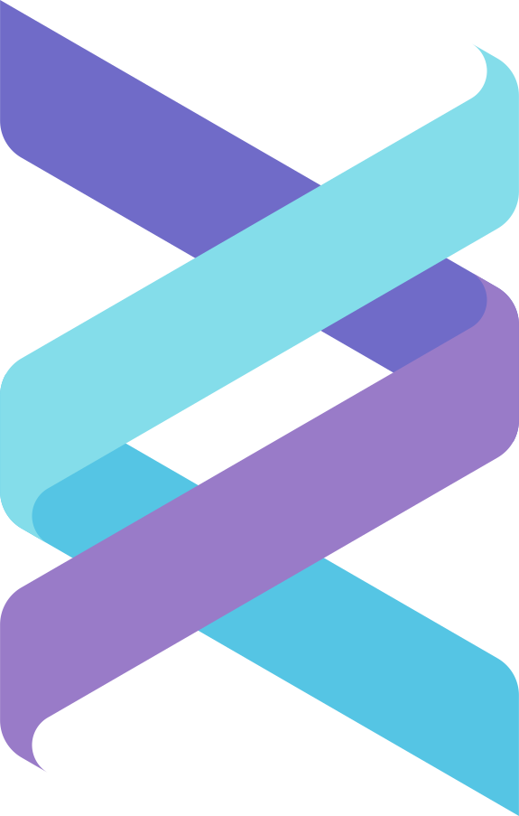

<div align="center">

# 👋 Hi there! I'm Esmil


[](https://github.com/CompileRIder)

</div>

---

## 🦀 About Me

```rust
struct Developer {
    name: &'static str,
    languages: Vec<&'static str>,
    currently_learning: &'static str,
    fun_fact: &'static str,
}

impl Developer {
    fn new() -> Self {
        Self {
            name: "Esmil",
            languages: vec!["C++ (started here)", "Rust (current obsession)"],
            currently_learning: "Rust ecosystem",
            fun_fact: "Started with C++, stayed for Rust 🦀",
        }
    }
}
```


* 🦀 **Languages:** C++ → Rust
* 🌱 **Learning:** Rust development
* 🔧 **Building:** Personal Rust projects
* ☕ **Status:** Powered by coffee

<br clear="right">

---

## 🛠️ What I Actually Know

<div align="center">

### Languages

-000000?style=for-the-badge&logo=rust&logoColor=white)

### Tools





</div>

---

## 🤝 Connect With Me

<div align="center">

[](https://github.com/CompileRIder)
[](https://www.linkedin.com/in/esmil-vicioso-mercado-7885b9388/)
[](mailto:esmilviciosomercado@gmail.com)

</div>

---

<div align="center">

**"The compiler is not your enemy. It just hates you personally."** 🦀


</div>
